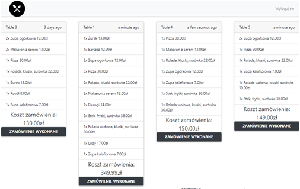
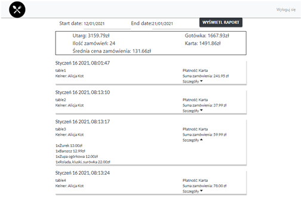
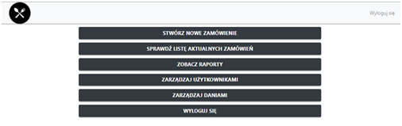

# Restaurant web application
 _Web application for managing your restaurant easily_

## Table of contents

* [General info](#general-info)
* [Technologies](#technologies)
* [Preview](#preview)
* [Setup](#setup)
* [Contact](#contact)

## General info
Project is web application, which was designed to help with managing the restaurant. Allows the manager of the restaurant to create menu, manage users, analyze financial data and make an orders. Application is also cooperating with mobile application for iOS and Android via Firestore database, which includes the order module.

## Technologies
Restaurant web application uses a lot of open source project to work properly:
* [Javascript]
* [ReactJS]
* [Redux]
* [Firebase]
* [Node.js]
* [Bootstrap]


## Setup

Restaurant web application requires [Node.js](https://nodejs.org/) v10+ to run.
In project directory, you can run:

```sh
cd restaurantWebApplication/
npm install
npm start
```

## Preview
### Waiter Screen for orders

### Chef Screen for orders

### Manager Menu

## Contact
**bartoszskrobacki@gmail.com**


[//]: # (These are reference links used in the body of this note and get stripped out when the markdown processor does its job. There is no need to format nicely because it shouldn't be seen. Thanks SO - http://stackoverflow.com/questions/4823468/store-comments-in-markdown-syntax)

   [ReactJS]: <https://reactjs.org/>
   [git-repo-url]: <https://github.com/joemccann/dillinger.git>
   [Redux]: <https://redux.js.org/>
   [Firebase]: <https://firebase.google.com/>
   [Javascript]: <https://www.javascript.com/>
   [node.js]: <http://nodejs.org>
   [Bootstrap]: <https://getbootstrap.com/>
